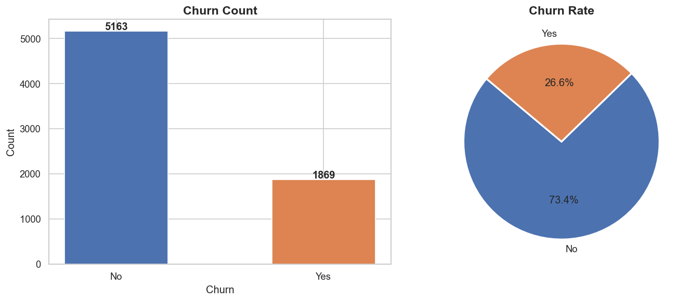
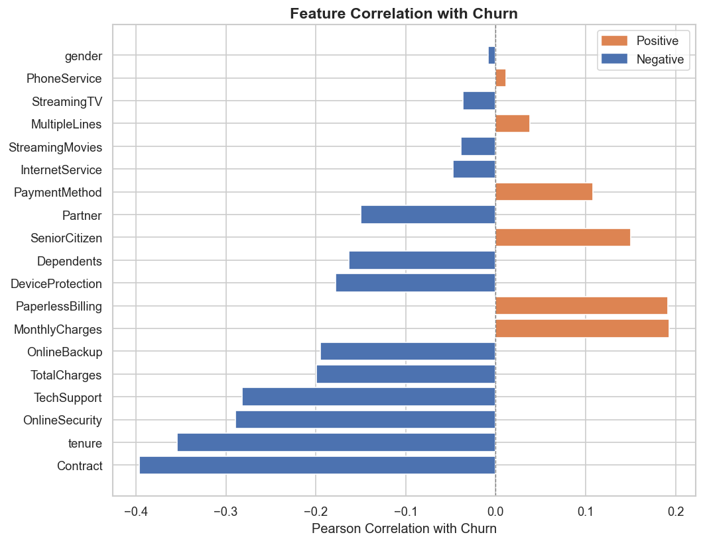
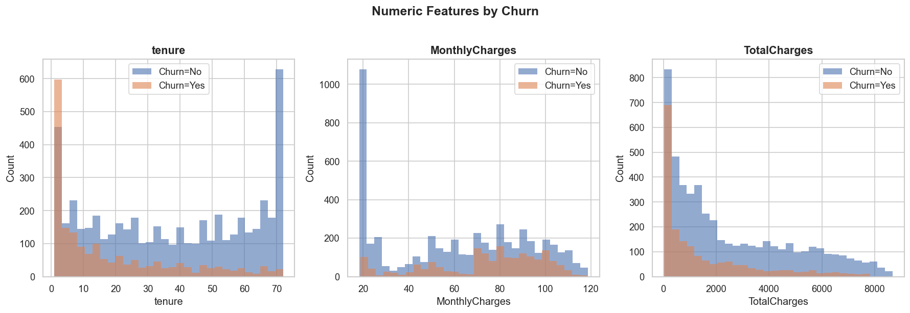
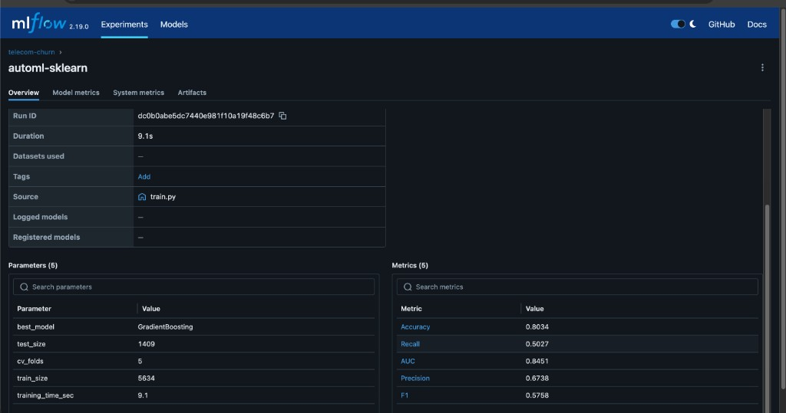
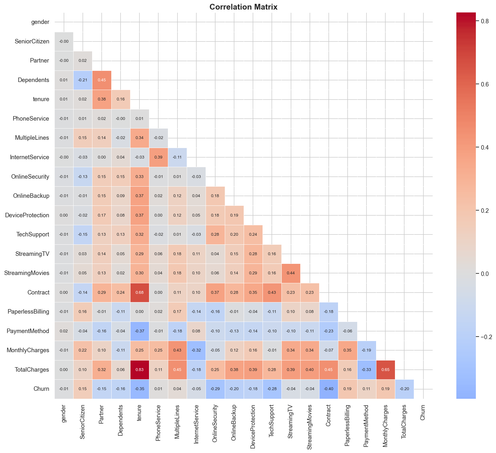
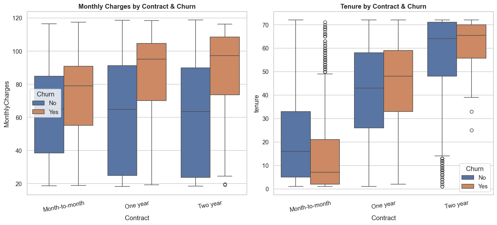
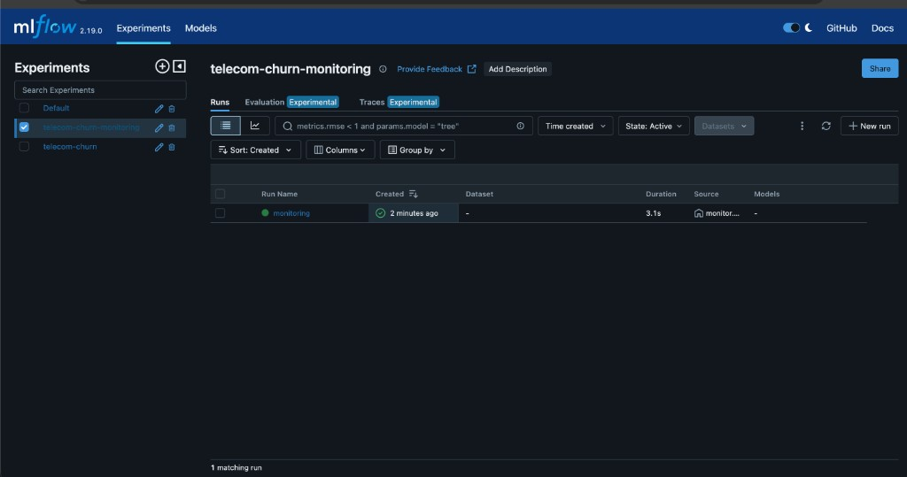

# Telecom Customer Churn Prediction

ML-пайплайн для предсказания оттока клиентов телеком-компании.

---

## Бизнес-задача

Отток клиентов (churn) — одна из главных проблем телеком-операторов. Стоимость привлечения нового клиента в 5–7 раз выше стоимости удержания существующего. Задача — **заранее выявить клиентов с высокой вероятностью ухода** и применить к ним персонализированные retention-кампании (скидки, улучшение условий тарифа и т.д.).

**Постановка задачи**: бинарная классификация — предсказать, уйдёт ли клиент (`Churn = 1`) или останется (`Churn = 0`).

**Датасет**: [Telco Customer Churn (IBM/Kaggle)](https://www.kaggle.com/datasets/blastchar/telco-customer-churn) — ~7 043 клиента, 20 признаков (тип контракта, тарифы, срок обслуживания, способ оплаты и др.).



---

## Production-стандарты

Проект оформлен как устанавливаемый Python-пакет `telecom_churn` (src-layout).

- Единый конфиг путей и гиперпараметров: `src/telecom_churn/config.py`
- Логирование через `logging` вместо `print`
- Импорты через пакет (`from telecom_churn.etl import transform`), без `sys.path.insert`
- CLI-команды Poetry: `churn-etl`, `churn-train`, `churn-monitor`, `churn-predict`, `churn-plots`

### Poetry и виртуальное окружение

Окружение **интегрировано в Git-репозиторий** через:

| Файл | Роль |
|---|---|
| `pyproject.toml` | манифест проекта, зависимости, CLI, настройки линтеров |
| `poetry.lock` | точные версии пакетов (воспроизводимый install) |
| `poetry.toml` | `virtualenvs.in-project = true` — venv создаётся в `.venv/` рядом с кодом |
| `.python-version` | фиксированная версия Python 3.11 |

Сама папка `.venv/` в git **не** коммитится (бинарники платформозависимы). В репозиторий попадает lockfile: любой клон делает `poetry install` и получает идентичное окружение.

```bash
pip install poetry
poetry install
poetry env info
pre-commit install
```

### Pre-commit и линтеры

Конфиг: `.pre-commit-config.yaml`. Хуки на каждый `git commit`:

- trailing-whitespace, end-of-file-fixer, check-yaml/toml
- **black** — форматирование
- **isort** — сортировка импортов
- **ruff** — быстрый линтер
- **flake8** — стиль (max-line-length=100)

```bash
pre-commit install
pre-commit run --all-files
```

---

## Схема пайплайна

```
Raw CSV
   |
   v
[Extract] --> загрузка данных
   |
   v
[Transform] --> очистка, кодирование, масштабирование
   |
   v
[Load] --> processed CSV
   |
   v
[AutoML] --> compare 9 моделей --> tune_model (RandomizedSearchCV)
   |
   v
[best_model.pkl]
   |
   +-----------> [MLflow] логирование метрик (AUC, F1, Precision, Recall)
   |
   +-----------> [evidently] отчёт о дрейфе данных (DataDriftReport)
```

---

## ETL-пайплайн

### Extract (`src/telecom_churn/etl/extract.py`)

Загрузка сырых данных из CSV-файла. Если файл отсутствует, выполняется автоматическая загрузка из публичного репозитория IBM.

```python
df = extract()  # --> pd.DataFrame, 7043 строки x 21 столбец
```

### Transform (`src/telecom_churn/etl/transform.py`)

| Операция | Детали |
|---|---|
| Удаление `customerID` | идентификатор, не несёт предсказательной силы |
| `TotalCharges` → numeric | строки с пробелами заменяются медианой |
| Кодирование `Churn` | `Yes` → 1, `No` → 0 |
| Бинарные признаки (Yes/No) | `Partner`, `Dependents`, `PhoneService`, `PaperlessBilling` → 0/1 |
| Многоклассовые категории | `Contract`, `PaymentMethod`, `InternetService` и др. → `LabelEncoder` |
| Масштабирование | `tenure`, `MonthlyCharges`, `TotalCharges` → `StandardScaler` (mean=0, std=1) |

### Load (`src/telecom_churn/etl/load.py`)

Сохранение обработанного DataFrame в `data/processed/telco_churn_processed.csv`.





**Запуск ETL:**
```bash
poetry run churn-etl
```

---

## Архитектура ML-модели (кастомный AutoML на scikit-learn)

Реализован собственный AutoML-пайплайн в `src/telecom_churn/model/train.py`, который автоматически:

1. **compare_models** — сравнивает 9 алгоритмов по 5-fold cross-validation (метрика AUC)
2. **tune_model** — тюнинг гиперпараметров лучшей модели через `RandomizedSearchCV`
3. **evaluate** — финальная оценка на отложенной тестовой выборке (20%)
4. **save_model** — сохранение в `models/best_model.pkl` через `pickle`
5. **MLflow logging** — логирование всех метрик, параметров и артефакта модели

**Перебираемые алгоритмы:**

| Алгоритм | Библиотека |
|---|---|
| Logistic Regression | scikit-learn |
| Random Forest | scikit-learn |
| Gradient Boosting | scikit-learn |
| Extra Trees | scikit-learn |
| AdaBoost | scikit-learn |
| Decision Tree | scikit-learn |
| K-Nearest Neighbors | scikit-learn |
| LightGBM | lightgbm |
| XGBoost | xgboost |

**Запуск обучения:**
```bash
poetry run churn-train
```

### Метрики модели

| Метрика | Значение |
|---|---|
| AUC | 0.8451 |
| F1-score | 0.5758 |
| Precision | 0.6738 |
| Recall | 0.5027 |
| Accuracy | 0.8034 |

Лучшая модель: **Gradient Boosting** (выбрана автоматически из 9 кандидатов по AUC на 5-fold CV).







Метрики логируются в MLflow и доступны через UI: `mlflow ui --backend-store-uri mlruns/`.

---

## Тестирование

Тесты реализованы с помощью `pytest` и находятся в папке `tests/`.

| Файл | Что тестирует |
|---|---|
| `test_etl.py` | transform (формы, типы, отсутствие NaN, масштабирование), load (файл создан, строки, столбцы) |
| `test_model.py` | sklearn-модель (форма предсказаний, бинарность, вероятности, сериализация), целостность данных |

**Запуск:**
```bash
poetry run pytest tests/ -v
```

---

## Docker-контейнер

### Dockerfile

```
FROM python:3.11-slim
RUN pip install poetry
COPY pyproject.toml poetry.lock .
RUN poetry config virtualenvs.create false && poetry install --only main
COPY src/ ./src/
CMD ["churn-train"]
```

### Функции контейнеризации

- **Изоляция среды**: зависимости зафиксированы в `poetry.lock`
- **Безопасность**: `python:3.11-slim` — минимальный образ; `.dockerignore` исключает секреты, логи, notebooks, `.venv`
- **Оптимизация ресурсов**: Poetry ставит только группу `main`; `libgomp1` для LightGBM
- **Volumes**: данные (`data/`), модели (`models/`) и MLflow (`mlruns/`) монтируются снаружи

**Запуск:**
```bash
# Только обучение
docker build -t telecom-churn .
docker run -v $(pwd)/data:/app/data -v $(pwd)/models:/app/models telecom-churn

# Все сервисы через docker-compose
docker-compose up train
docker-compose up monitor
docker-compose up mlflow      # MLflow UI на http://localhost:5000
```

---

## CI/CD

Реализован с помощью **GitHub Actions** (`.github/workflows/ci.yml`).

### Шаги пайплайна

```
push / pull_request → main
         |
         v
    [test job]
    1. Checkout code
    2. Setup Python 3.11
    3. poetry install
    4. ruff + flake8
    5. pytest tests/ -v
         |
         v (if tests pass)
    [build job]
    6. docker/setup-buildx-action
    7. docker build -t telecom-churn:<sha> .
    8. docker run --rm ... python -c "import mlflow; import lightgbm; import xgboost"
```

### Использованные git-команды

```bash
git init
git add .
git commit -m "initial project structure"
git remote add origin <url>
git push -u origin main

git checkout -b feature/etl
git add src/etl/
git commit -m "add ETL pipeline"
git push origin feature/etl
git checkout main && git merge feature/etl

git log --oneline
git status
git diff HEAD
git tag v1.0.0
git push origin v1.0.0
```

---

## Мониторинг

Реализован в `src/telecom_churn/monitoring/monitor.py`.

### Мониторинг качества модели

- **MLflow Tracking**: каждый запуск обучения логирует метрики (AUC, F1, Precision, Recall, Accuracy), параметры модели и артефакт `.pkl`
- **evidently DataDriftReport**: сравнивает train/test выборки по распределению каждого признака. Определяет статистически значимый дрейф (тест Колмогорова-Смирнова для числовых, χ² для категориальных). HTML-отчёт сохраняется в `reports/drift_report.html`

### Мониторинг инфраструктуры

Собирается через `psutil` и логируется в MLflow:

| Метрика | Назначение |
|---|---|
| `cpu_percent` | загрузка CPU во время обучения |
| `memory_used_gb` / `memory_percent` | потребление ОЗУ |
| `disk_used_gb` / `disk_percent` | использование диска |
| `drift_report_time_sec` | время генерации отчёта |

**Запуск:**
```bash
poetry run churn-monitor
poetry run mlflow ui --backend-store-uri mlruns/
```



---

## Стек технологий

| Компонент | Технология |
|---|---|
| ETL | pandas, scikit-learn |
| AutoML | scikit-learn, LightGBM, XGBoost |
| Эксперимент-трекинг | MLflow |
| Мониторинг дрейфа | evidently |
| Менеджер зависимостей | Poetry |
| Линтеры | ruff, flake8, black, isort, pre-commit |
| Тестирование | pytest |
| Контейнеризация | Docker, docker-compose |
| CI/CD | GitHub Actions |
| Язык | Python 3.11 |

---

## Структура проекта

```
dz/
├── src/telecom_churn/
│   ├── config.py               # пути, seed, experiment names
│   ├── logging_config.py
│   ├── etl/
│   │   ├── extract.py
│   │   ├── transform.py
│   │   ├── load.py
│   │   └── pipeline.py
│   ├── model/
│   │   ├── train.py
│   │   └── predict.py
│   ├── monitoring/
│   │   └── monitor.py
│   └── visualization/
│       └── plots.py
├── tests/
├── pyproject.toml              # Poetry + линтеры
├── poetry.lock                 # lockfile окружения в Git
├── poetry.toml                 # in-project .venv
├── .pre-commit-config.yaml
├── .python-version
├── Dockerfile
├── docker-compose.yml
└── .github/workflows/ci.yml
```

---

## Быстрый старт

```bash
pip install poetry
poetry install
pre-commit install

poetry run churn-etl
poetry run churn-train
poetry run churn-monitor
poetry run pytest tests/ -v
poetry run mlflow ui --backend-store-uri mlruns/
```
